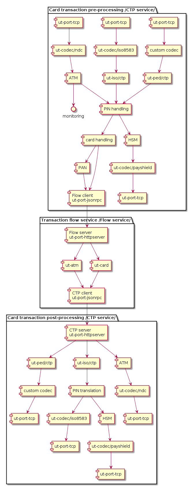
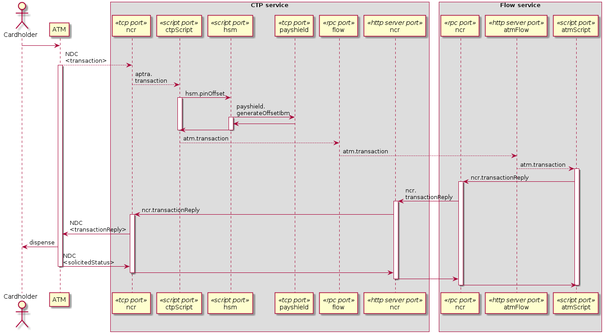

# Card transactions pre-processing module (ut-ctp)

## Scope

1. Implement the communication with PayShield 9000 HSM
   * PIN verification
   * PIN translation
   * PIN deriving
   * PIN mailer printing
   * TPK generation
   * TAK generation
   * MAC generation
   * MAC verification
   * ZPK import
   * ZPK generation
1. Proxy the communications with APTRA Advance NDC based ATM
   * Map between card and card ID - full card number will never go to or come from other modules
   * PIN verification - as card number is needed for PIN verification, the verification should happen within this module
   * Handle functionality related to TAK, TPK, MAC
1. Proxy the communications with ISO8583 based switch
   * Map between card and card ID - full card number will never go to or come from other modules
   * PIN verification
   * Handle functionality related to ZPK, MAC
1. Proxy the communications with ISO8583 based POS
   * Map between card and card ID - full card number will never go to or come from other modules
   * PIN verification
   * Handle functionality related to TAK, TPK, MAC
1. Implement card management functions that depend on card number
   * Card number generation
   * Export of files used for card production
1. Handle mapping between card and card ID in import / export scenarios related to transaction reconciliation

## Component diagram

CTP module uses a number of components, including ones from other modules, so that it can pre-process and post-process transactions related to ATM, ISO8583 POS/switch and PIN entry device (PED). The purpose of pre-processing is to remove or encrypt sensitive cardholder data, such as card number and convert PIN block to PIN offset. The purpose of post-processing is to decrypt what was encrypted during pre-processing, do PIN translation and route the response to the proper channel and terminal. The pre-processing and post-processing happens in a separate service - CTP service, while the rest of the logic is happening in another service - Flow service. The following diagram shows how the different components interact. In the diagram, the single CTP service is shown twice, to distinguish the pre-processing and post-processing and to avoid putting too many components in a single place.



## Withdraw sequence diagram


## Public API

The CTP module is meant to be run as a separate service for each channel/device type it handles, using the following pattern:

```js
require('ut-ctp/run')({
    type: 'ncr', // the type of channel/device to handle
    app: 'server/ncr', // path to configuration folder
    env: 'prod' // environment
});
```

CTP module exposes the following methods through RPC server interface:

### ```ncr.goOutOfService({conId})``` - sets an ATM to out of service mode

* ```conId``` - identifies the ATM connection

### ```ncr.goInService({conId})``` - sets an ATM to in service mode

* ```conId``` - identifies the ATM connection

### ```ncr.keyChangeTak({conId, tmk})``` - generate and set a new Terminal Authentication Key (TAK) for the ATM

* ```conId``` - identifies the ATM connection
* ```tmk``` - the terminal master key of the ATM

### ```ncr.keyChangeTpk({conId, tmk})``` - generate and set a new Terminal PIN Key (TPK) for the ATM

* ```conId``` - identifies the ATM connection
* ```tmk``` - the terminal master key of the ATM

### ```atmAgent.restartMachine({terminalId})``` - restart the АТМ through agent

* ```terminalId``` - database key in the atm.terminal table

### ```pan.number.generate({panLength, count, checkSum, start, prefix, cipher})``` - generate, encrypt and store a sequence of card numbers

* ```panLength``` - length of the card number
* ```start``` - start value of the sequence
* ```count``` - count to generate
* ```checkSum``` - check sum algorithm to use; pass 'luhn' or true to use Luhn algorithm
* ```prefix``` - card number prefix
* ```cipher``` - encryption algorithm

### ```pan.number.encrypt({card})``` - encrypt a card number

* ```card``` - card number to encrypt

### ```pan.generateAndPrintPin.list({pans, pinLength, pinMailerFormat})``` - generate PINs and print them on print mailers

* ```pans``` - array of {pan, cipher, pvk, decimalisation} objects, holding encrypted card data
* ```pinLength``` - length of the generated PINs
* ```pinMailerFormat``` - PIN mailer format to pass to the HSM

### ```pan.generateCvv.list(pans)``` - generate CVV for list of cards

* ```pans``` - array of {cardId, pan, cipher, cvk, expirationDate, serviceCode, cvv1, cvv2, icvv, cavv} objects, holding encrypted card data and flags (cvv1, cvv2, icvv, cavv) indicating withc CVV to generate

### ```pan.production.map({file})``` - decrypt fields in a card production file and save result in temp file

* ```file``` - file name of the card production file

### ```pan.key.encrypt({key, cipher})``` - encrypt a key

* ```key``` - key to encrypt
* ```cipher``` - cipher to use

### ```pan.generateThreeComponentZmk({component1, component2, component3})``` - form a Zone Master Key(ZMK) from clear components

* ```component1```, ```component2```, ```component3``` - clear components to use

### ```pan.genKey({mode, keyType, keyScheme, keyZmkTmkFlag, keyZmkTmk, keyScheme1, cipher})``` - generate key at the HSM

* ```mode``` - see HSM docs
* ```keyType``` - see HSM docs
* ```keyScheme``` - see HSM docs
* ```keyZmkTmkFlag``` - see HSM docs
* ```keyZmkTmk``` - see HSM docs
* ```keyScheme1``` - see HSM docs
* ```cipher``` - cipher to use when encrypting the resulting key

### ```pan.genKcv({kcvType, key, cipher})``` - generate key check value

* ```kcvType``` - see HSM docs
* ```key``` - see HSM docs (encrypted)
* ```cipher``` - cipher used for encrypting key field

### ```pan.generateArqc({modeFlag, schemeId, mkac, ivac, panSeqNo, branchHeightParams, atc, transactionData, arqc, arc, csu, pad})``` - generate response cryptoram

* ```modeFlag``` - see HSM docs
* ```schemeId``` - see HSM docs
* ```mkac``` - see HSM docs
* ```ivac``` - see HSM docs
* ```panSeqNo``` - see HSM docs
* ```branchHeightParams``` - see HSM docs
* ```atc``` - see HSM docs
* ```transactionData``` - see HSM docs
* ```arqc``` - see HSM docs
* ```arc``` - see HSM docs
* ```csu``` - see HSM docs
* ```pad``` - see HSM docs

### ```pan.translateBdkZmkLmk({zmk, bdk})``` -

* ```zmk``` -
* ```bdk``` -

### ```pan.translateBdkLmkZmk({zmk, bdk})``` -

* ```zmk``` -
* ```bdk``` -

### ```pan.importKey({keyType, zmk, keyA32, keyScheme})``` - import a key

* ```keyType``` - see HSM docs
* ```zmk``` - see HSM docs
* ```keyA32``` - see HSM docs
* ```keyScheme``` - see HSM docs

### ```iso.0200(msg)``` - send ISO8583 message 0200

* ```msg``` - object, that contains ISO8583 fields (data elements) as properties

## Private API

### ```pan.offset.get({track2, pinKey, pinBlock, pinBlockNew, keyType})``` - lookup card, calculate PIN offset and encrypt sensitive fields

* ```track2``` -
* ```pinKey``` -
* ```pinBlock``` -
* ```pinBlockNew``` -
* ```keyType``` -
